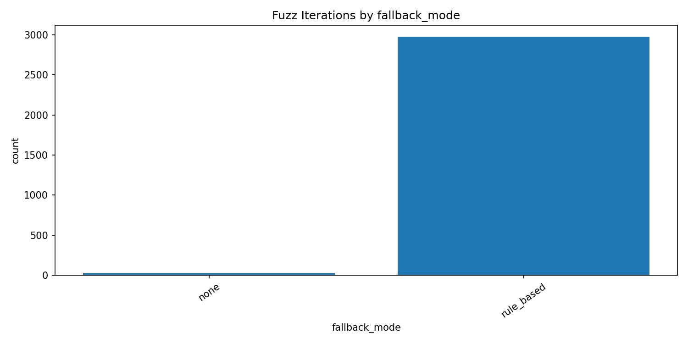
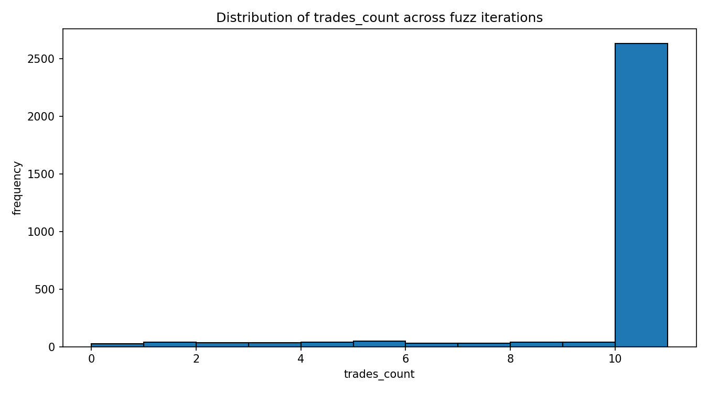
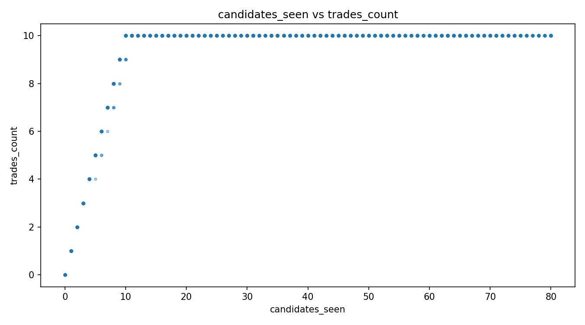

# AI Trade-Selection Stress Test Report

This report is generated from an isolated module stress test (`llm_trader.py` only).
No scheduler/main pipeline run was executed.

## Summary

- Generated (UTC): 2026-02-27T09:48:06.558384+00:00
- Random seed: 20260227
- Fuzz iterations: 3000
- Fuzz runtime (s): 1.537
- Exceptions: 0
- Non-ok results: 0
- CJK reason violations: 0

## Fallback Mode Counts (Fuzz)

- none: 25
- rule_based: 2975

## Targeted Cases (actual run outputs)

| case | ok | fallback_mode | skipped_reason | trades_count | cjk_reason_count | error |
|---|---:|---|---|---:|---:|---|
| missing_keys | 1 | rule_based | - | 3 | 0 | ai: missing NVIDIA_REASONING_API_KEY / default: missing NVIDIA_API_KEY |
| all_chat_fail | 1 | rule_based | - | 3 | 0 | ai: simulated_chat_failure / default: simulated_chat_failure |
| parse_error | 1 | rule_based_after_parse_error | - | 3 | 0 | LLM response missing JSON. |
| schema_error | 1 | rule_based_after_empty_trades | - | 3 | 0 | LLM returned no usable trades. |
| empty_usable | 1 | rule_based_after_empty_trades | - | 3 | 0 | LLM returned no usable trades. |
| japanese_reason_sanitized | 1 | - | - | 2 | 0 |  |
| no_candidates | 1 | - | no_candidates | 0 | 0 |  |

## Visuals

## Raw Data Files

- `stress_test_results.json`
- `targeted_cases.csv`
- `fuzz_iterations.csv`